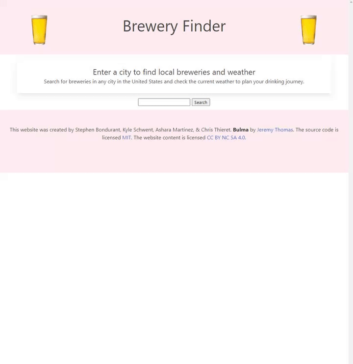

# Brewery-Finder!

## Description

This application allows users to search for breweries in a desired city and it will also display the current weather within that city.
## Visuals

## Usage

The purpose of this application is to allow users to find local breweries to visit, and to make them aware of the weather for the journey ahead. It can also be used to search for breweries in any other city that the user may desire.

## URL

https://steveb175.github.io/Brewery-Finder/

## Credits

[Bulma](https://bulma.io/)  
[OpenWeatherMap](https://openweathermap.org/api)  
[OpenBreweryDB](https://www.openbrewerydb.org/)  

## License

MIT
